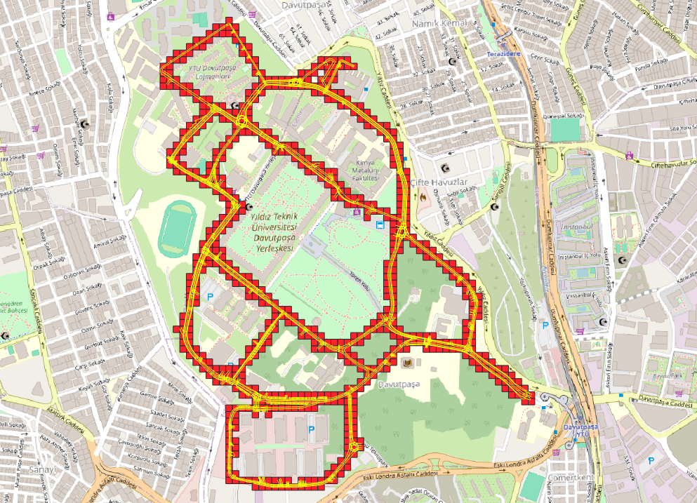
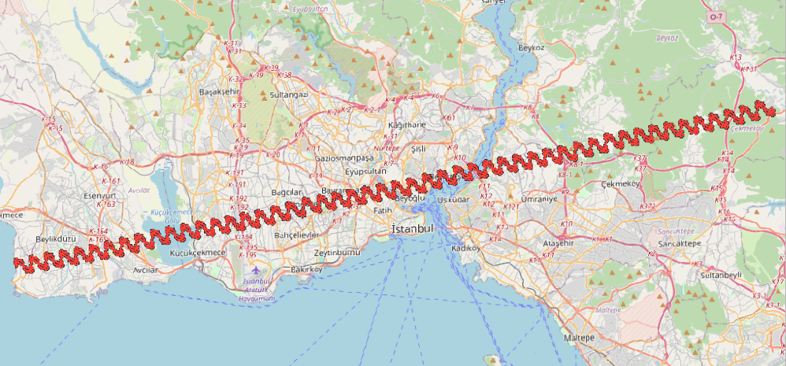
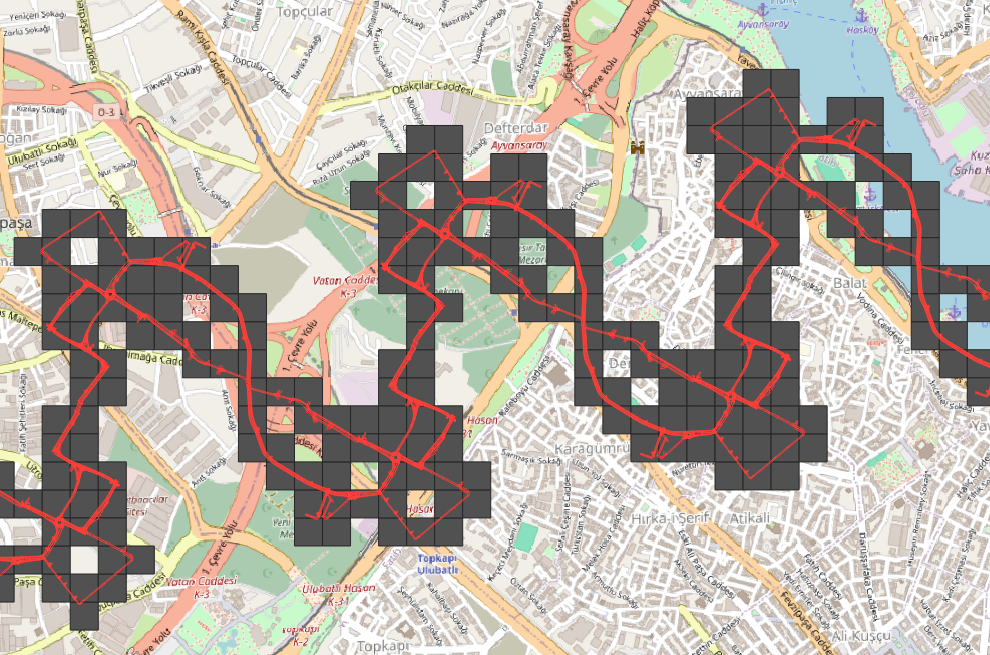
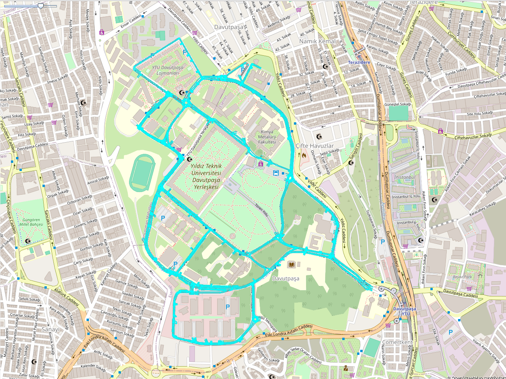
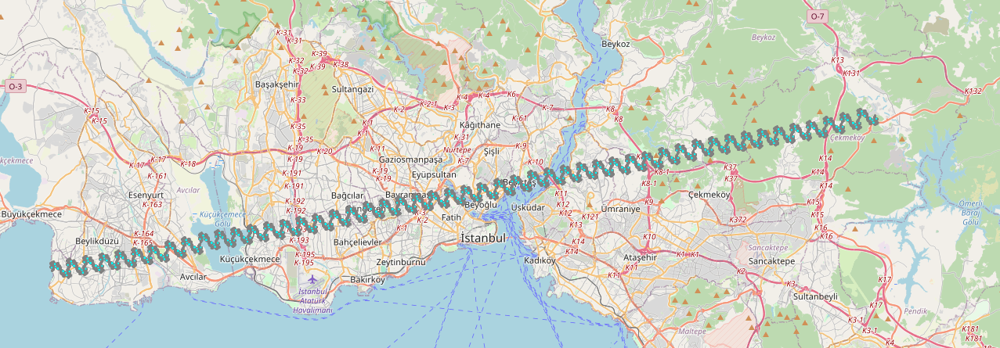

# Lanelet2 Map Tile Generator

This is the Lanelet2 Map Tile Generator tool for Autoware Dynamic Lanelet2 Map Loading feature.

Working principal of this tool is sequentally:
- Take the inputs from the user
- Generate square grids according to the input MGRS grid
- Filter generated square grids with the input lanelet2_map.osm
- Generate map tiles from filtered grids and input lanelet2_map.osm with Osmium Tool


## System Requirements

- [Python](https://www.python.org/) (tested with 3.10)
- [Poetry package](https://pypi.org/project/poetry/)
- [Osmium Tool](https://github.com/osmcode/osmium-tool)

## Inputs

### MGRS Grid

100 kilometer MGRS grid that the input lanelet2_map is in. This is needed for generating the grids inside of the
MGRS grid and filtering them.

### Grid Edge Size

This determines the vertice length of the generated map tiles. Map tiles are generated with squares and the edges of
those squares are determined by the user's input.

### Input Lanelet2 Map Path

The full path of the input `lanelet2_map.osm`. This file won't be corrupted.

## Outputs

### lanelet2_map.osm Folder

This is a folder. Autoware's dynamic lanelet2 map loading pipeline needs this folder to find generated map-tiles.
It contains all the generated lanelet2 maps.

### lanelet2_map_metadata.yaml

This metadata file holds the origin points of all the generated lanelet2 map files inside the `lanelet2_map.osm`
folder. Origin point of each lanelet2 map is the coordinates of the left bottom vertice of the corresponding
square created with `mgrs_grid` and `grid_edge_size` parameters.

### config.json Files

Those files contain the coordinates of the vertices of the created squares. With those coordinates, **Osmium Tool**
runs an **extract** operation and divides the input lanelet2_map.osm file.

### output_layers.gpkg

This file contains the geographical visualization for generated data. This is not used in Autoware or somewhere else.
It is generating only for debugging the output files. [QGIS](https://qgis.org/en/site/) can be used for opening this
file. You need to see the visualizations of generated grids, filtered grids and input lanelet2 map.
<p align='center'>
    
</p>
<p align='center'>
    
    
</p>


## Installation

**Poetry** and **Osmium Tool** is necessary for running this tool. If you don't have them, here are the installations:

### Poetry:

```bash
pip install poetry
```

### Osmium Tool

https://github.com/osmcode/osmium-tool?tab=readme-ov-file#building

```bash
cd <path-to-libraries>
git clone https://github.com/osmcode/osmium-tool.git
cd osmium-tool
mkdir build
cd build
cmake ..
ccmake .  ## optional: change CMake settings if needed
make
```

### Lanelet2 Map Tile Generator

```bash
git clone https://github.com/leo-drive/lanelet2-map-tile-generator.git
cd lanelet2-map-tile-generator
poetry shell      # creates the poetry environment
poetry install    # installs the prerequisites written in poetry.lock and poetry.toml
```

## Running

```bash
cd <path-to-lanelet2-map-tile-generator>
poetry run python ./src/lanelet2_map_tile_generator/main.py \
--mgrs_grid 35TPF \
--grid_edge_size 100 \ 
--input_lanelet2_map <path-to-input_lanelet2_map> \
--output_folder <path-to-output-folder> \
```

## Example Data
### Yildiz Technical University Original Lanelet2 Map
This is an original lanelet2 map file that contains stop lines, speed bumps or other regulatory elements:
https://drive.google.com/drive/folders/1VFN0zidAHzIuQCnznVaFzefqqdRS_X5l?usp=drive_link

<p align='center'>
    
</p>

### Yildiz Technical University Extended Lanelet2 Map (Synthetic)
This is the extended version of the original lanelet2 map file. We extended it to 80 kilometers by hand.
Still it contains all the regulatory elements:
https://drive.google.com/drive/folders/1CRBYp19_NXzHXxL9JkO_ffbhGARoRaAV?usp=drive_link

<p align='center'>
    
</p>

## Params

| Param              | Description                                             |
|--------------------|---------------------------------------------------------|
| mgrs_grid          | The 100 kilometer MGRS grid that the lanelet2 map is in |
| grid_edge_size     | Wanted edge length in meters for map-tiles to generate  |
| input_lanelet2_map | Full path of the lanelet2_map to divide                 |
| output_folder      | Full path of the output folder to fill                  |
